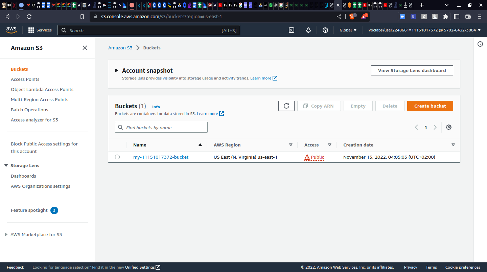
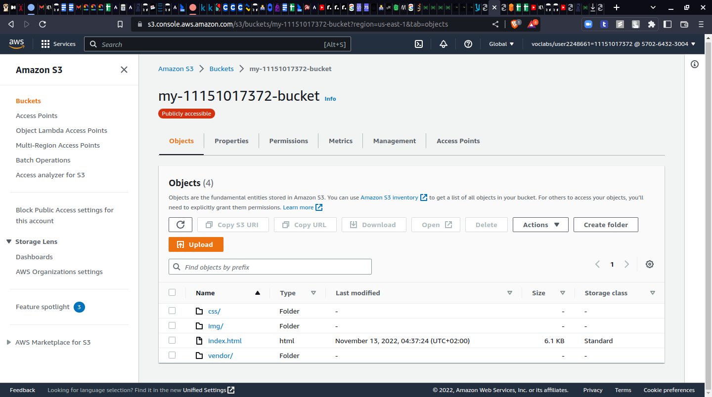
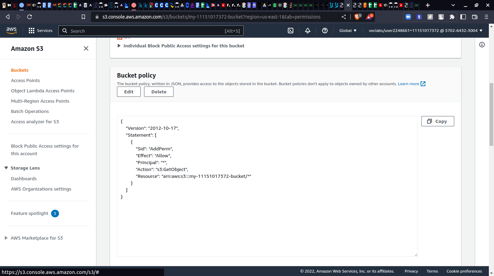
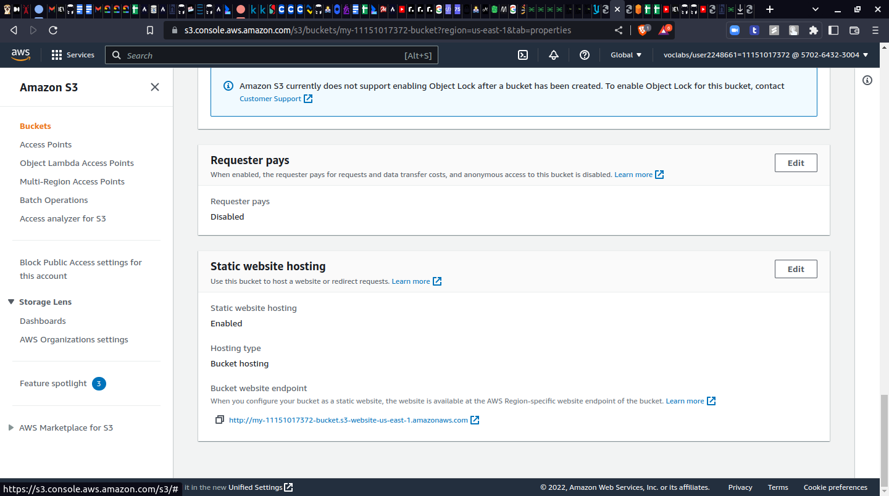
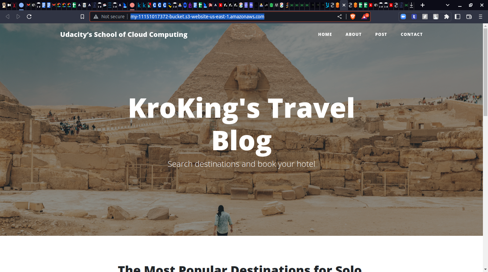
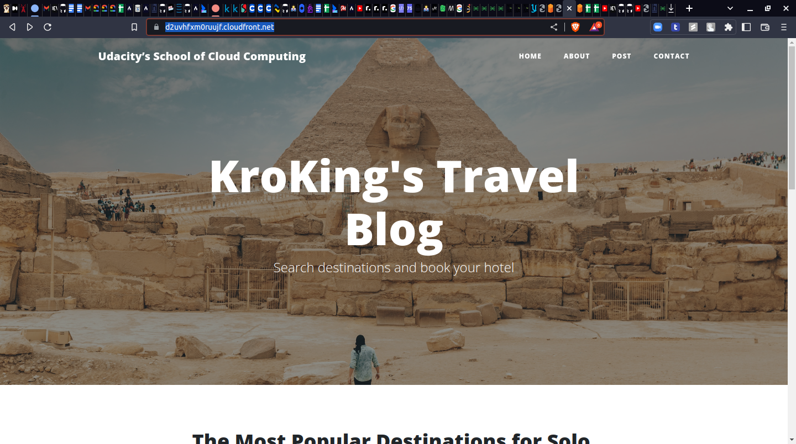
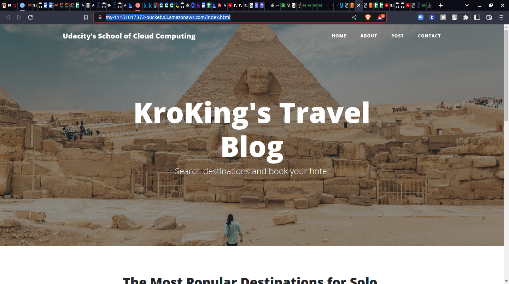

# The website links
Link via static config from s3 bucket:

http://my-11151017372-bucket.s3-website-us-east-1.amazonaws.com/

Link of the object from s3 bucket:

https://my-11151017372-bucket.s3.amazonaws.com/index.html

Link through the CDN (Cloud Front) distro:

https://d2uvhfxm0ruujf.cloudfront.net/

## The process
- create the S3 bucket

- Upload the files to the bucket

- Bucket Polices applied

- Allow the Static Hosting via Bucket config

- create the CDN through the Cloud front service AWS

.png)

- Links through different access

![image] 
## Thanks 
- Mahmoud Galal
